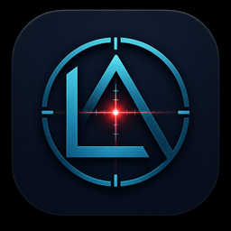

# LaserWatch

**LaserWatch** is a Windows desktop application for UVC-camera-based laser beam profiling,
pointing monitoring, and long-term stability logging.

Current development release: **v0.8.5**



The application, packaged `.exe`, Start Menu shortcut, and desktop shortcut are configured to use this icon.

> Status: research software under active hardware validation. The core analysis and
> regression tests are automated, but camera controls, pixel formats, exposure behavior,
> and high-bit-depth paths must still be verified for each actual UVC camera/driver.

## Download for Windows

**Recommended:** download the normal Windows installer directly from the latest GitHub Release:

[**Download LaserWatch installer for Windows**](https://github.com/hiro-moto/LaserWatch/releases/latest/download/LaserWatch_Setup_latest.exe)

Portable build:

[Download portable ZIP](https://github.com/hiro-moto/LaserWatch/releases/latest/download/LaserWatch_portable_latest.zip)

The installer is built automatically on a clean GitHub-hosted Windows runner. Python and `uv` are **not required** on the PC that installs LaserWatch.

Release page: <https://github.com/hiro-moto/LaserWatch/releases/latest>

## Main capabilities

- Multiple UVC cameras in one application.
- Persistent Windows camera identity using DirectShow device information where available.
- Manual exposure and laser-oriented **Auto Optimize Exposure**.
- Monochrome and color cameras.
- Gray / R / G / B analysis selection for color cameras.
- RGB-aware saturation detection so one saturated color channel is not hidden by grayscale conversion.
- Selectable effective 8 / 10 / 12 / 16-bit interpretation.
- Dark-frame averaging and Raw / Dark-corrected display.
- Mouse-drawn manual ROI.
- **Fixed target**: click near a desired spot and lock measurement to that local optical target.
- **Auto ROI**: SEARCHING / TRACKING / full-frame reacquisition after beam loss.
- Connected-component spot isolation and `BEAM_NOT_FOUND` state.
- Centroid, D4σ, Gaussian-equivalent FWHM, principal-axis angle, peak and integrated intensity.
- Live X/Y beam cross-section profiles through the measured centroid.
- Pointing, beam-size and intensity time series.
- Stability statistics including σ, peak-to-peak, radial RMS and intensity CV.
- Pointing PSD.
- Reference alarms.
- CSV session logging and asynchronous HDF5 raw-frame recording.
- JSON / CSV summaries and standalone HTML measurement report.
- Runtime diagnostics: actual FPS, analysis drops, camera reconnects, FOURCC, memory, disk space, etc.

## Overlay legend

The live image uses the following overlays:

- **green box** — optical component selected by Spot detection; this is a detection bounding box, **not** the beam diameter,
- **green +** — measured intensity centroid,
- **yellow box** — current analysis ROI,
- **blue +** — Fixed target anchor selected by the user.

## Measurement modes

### Full frame / Spot detection

The full camera image is searched and the principal bright component is isolated before
beam moments are calculated.

### Manual ROI

Drag a rectangle directly on the live image. Analysis remains inside that fixed region.

### Fixed target

Press **Pick fixed target**, then click near the intended beam. LaserWatch searches only
within the configured click-snap radius and snaps to the nearest local optical component.
A fixed yellow ROI is centered around the blue target anchor.

If the beam disappears, LaserWatch reports `BEAM_NOT_FOUND` and **does not jump to a
remote reflection**.

### Auto ROI

Auto ROI is intended for a moving beam. It uses:

```text
SEARCHING (full frame) -> TRACKING -> beam lost -> SEARCHING (full frame)
```

Unlike Fixed target, it is allowed to reacquire elsewhere after beam loss.

## Beam profile tab

The **Profile** tab shows horizontal and vertical cross sections through the measured
centroid. A small strip around the centroid is averaged to suppress pixel noise.

The tab includes:

- measured X profile,
- measured Y profile,
- Gaussian-equivalent comparison curves,
- measured FWHM X / Y,
- optional peak normalization.

The Gaussian-equivalent curve is a visual comparison derived from the measured FWHM;
it is not the optional nonlinear 2-D Gaussian fit.

## Quick start with uv

Recommended environment: **Windows 10/11, 64-bit, Python 3.12**.

Install [uv](https://docs.astral.sh/uv/), then from the repository root:

```powershell
uv sync
uv run python run.py
```

The repository includes `.python-version` and `pyproject.toml`. On the first `uv sync`,
uv resolves the environment and creates `uv.lock`; commit that generated lock file to the
repository if you want fully pinned dependency resolution for releases.

### Run regression tests

```powershell
.\scripts\run_tests.ps1
```

or run an individual test, for example:

```powershell
uv run python test_v084.py
```

## Using requirements.txt instead

For users who do not use uv:

```powershell
python -m venv .venv
.\.venv\Scripts\Activate.ps1
python -m pip install -r requirements.txt
python run.py
```

## Windows installer

The repository is already configured to create a conventional `.exe` installer.

LaserWatch uses:

1. **PyInstaller** to create `dist/LaserWatch/LaserWatch.exe`,
2. **Inno Setup 6** to create `LaserWatch_Setup_0.8.5.exe`.

Install Inno Setup once:

```powershell
winget install --id JRSoftware.InnoSetup -e
```

Then run:

```powershell
.\build_installer.bat
```

Expected installer:

```text
installer\output\LaserWatch_Setup_0.8.5.exe
```

See [`docs/INSTALLER.md`](docs/INSTALLER.md) for details.

## Automatic GitHub Release

`.github/workflows/windows-release.yml` performs the release build on a GitHub-hosted Windows runner.

It runs the regression suite, builds the PyInstaller application and Inno Setup installer, publishes the versioned Windows installer and portable ZIP to GitHub Releases, and also maintains stable `latest` asset names used by the direct-download links above.

A release build starts when the version or release-packaging configuration changes on `main`. It can also be started manually from **GitHub → Actions → Build and publish Windows release → Run workflow**.

For the next release, update the version in `pyproject.toml` and push to `main`.

## Session output

A typical logging session contains:

```text
2026_..._Camera/
├── config.json
├── measurement.csv
├── raw_frames.h5          # optional
├── raw_frames_002.h5      # optional segmented recording
├── summary.json
├── summary.csv
└── report.html
```

Raw HDF5 writing runs asynchronously with a bounded queue. If disk writing cannot keep
up, raw-frame drops are counted rather than blocking the live measurement pipeline.

## Important measurement notes

### D4σ

The current D4σ implementation uses second moments after dark/background handling,
thresholding and optional spot isolation. It is intended as a practical beam-profiler
metric. Do not claim strict ISO 11146 conformance without validating the complete
background, integration-area and calibration procedure for the intended experiment.

### Intensity

`Integrated intensity` is camera counts, not optical power, unless a separate radiometric
calibration has been performed.

### Color cameras

For color input, the selected Gray/R/G/B channel is used for beam-shape analysis, but
saturation and Auto Optimize Exposure use the maximum raw R/G/B signal.

### 10/12-bit UVC cameras

A 10- or 12-bit stream may arrive in a `uint16` container. In that case, set the effective
bit depth explicitly according to the camera/vendor output format. `Auto (container)`
interprets `uint16` conservatively as 16 bit.

### Camera synchronization

Generic UVC cameras are not assumed to be hardware synchronized. LaserWatch reports
software timestamp skew between latest frames; this is not equivalent to a shared
hardware trigger.

## Hardware acceptance

Before routine measurement with a new camera model, follow
[`docs/HARDWARE_ACCEPTANCE.md`](docs/HARDWARE_ACCEPTANCE.md).

The highest-priority checks are actual resolution/FPS/FOURCC, exposure behavior,
Mono/Color and bit-depth interpretation, unplug/replug recovery, multi-camera USB
bandwidth, and an 8–24 hour continuous-run test.

## Repository structure

```text
LaserWatch/
├── assets/                       # application icon assets (PNG / ICO)
├── laserwatch/                   # application package
├── installer/                    # Inno Setup definition
├── scripts/                      # tests and installer build scripts
├── docs/                         # installer and hardware acceptance notes
├── .github/workflows/            # Windows release automation
├── LaserWatch.spec                # PyInstaller definition
├── pyproject.toml
├── requirements.txt
├── run.py
└── test_*.py
```

## Disclaimer

LaserWatch is research software provided **“as is”**, without warranty of any kind, express or implied. The authors and contributors do not guarantee the correctness, accuracy, reliability, availability, fitness for a particular purpose, or suitability of the software or of any measurement result produced with it.

To the maximum extent permitted by applicable law, the authors and contributors shall not be liable for any direct, indirect, incidental, special, consequential, or other loss or damage arising from the use of, inability to use, or reliance on this software, including but not limited to equipment damage, sensor damage, data loss, loss of research time, or incorrect measurement results.

Users are solely responsible for validating LaserWatch, its configuration, calibration, camera behavior, and measurement results for their intended application before relying on them.

**LaserWatch does not provide laser-safety functions.** Appropriate laser-safety procedures, protective equipment, interlocks, beam containment, sensor protection, and compliance with applicable institutional and legal safety requirements must be implemented independently by the user.

The terms of the [MIT License](LICENSE) also apply.

## License

LaserWatch is released under the [MIT License](LICENSE).

## Changelog

See [`CHANGELOG.md`](CHANGELOG.md).
